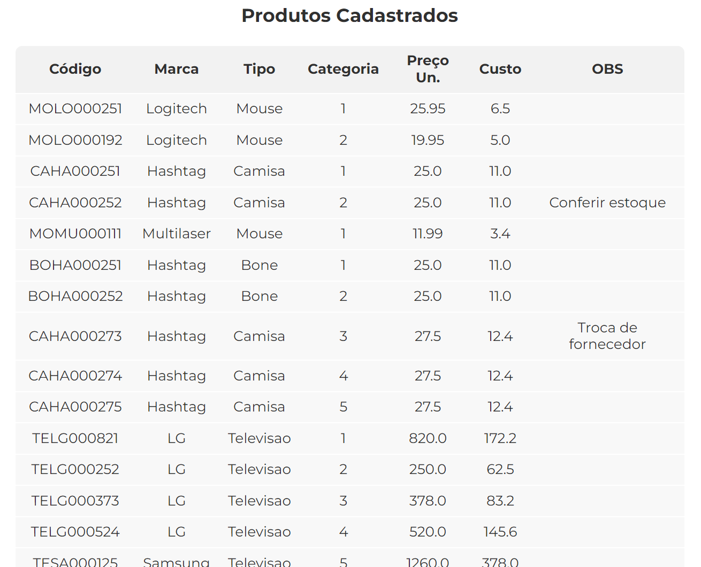

# Automation Product Registration with Python

This repository houses a Python script designed to automate the tedious task of registering products into a system. Originally conceived during the "Python Journey" crash course offered by Hashtag, this project provides a practical solution to a common business problem: efficiently managing large datasets.

## Project Overview

Your boss hands you a massive database of 300 products, asking you to register them all in the company's system by the end of the day. Manually entering hundreds of product records into a system is time-consuming and prone to errors. So, this project addresses this challenge by using Python to automate the process. The script leverages the ```pyautogui``` library, which allows us to control the mouse and keyboard programmatically, effectively mimicking human interaction with the system interface.

## Dataset

The product information is stored in a CSV file named ```produtos.csv```. The file should contain columns for:

- ``codigo``: product code
- ``marca``: brand
- ``tipo``: type
- ``categoria``: category
- ``preco_unitario``: unit price
- ``custo``: cost
- ``obs``: observations on the product (optional)

## Automation Process

The script executes the following steps:

1. **Open Browser and Navigate to System:** The script launches the Chrome browser and navigates to the [system's login page](https://dlp.hashtagtreinamentos.com/python/intensivao/login).
2. **Login:** Enters the provided login credentials (email: victorzucchetti@hotmail.com, password: strong password).
3. **Load Product Data:** Reads the ``produtos.csv`` file using the Pandas library, storing the data in a DataFrame.
4. **Product Registration Loop:** Iterates through each row in the DataFrame, entering the product information into the system's form. The script uses:
    - ``pyautogui.click()`` to select input fields
    - ``pyautogui.write()`` to input product data
    - ``pyautogui.press('tab')`` to move between fields
    - ``pyautogui.press('enter')`` to submit the form
    - ``pyautogui.scroll()`` to navigate the page if needed
5. **Repeat until All Products are Registered**

#### Example of Loop Code Block:

```python
for line in table.index:
    pyautogui.click(x=-1422, y=292)  # Click on product code field
    pyautogui.write(str(table.loc[line, "codigo"]))
    pyautogui.press("tab")
    pyautogui.write(str(table.loc[line, "marca"]))
    pyautogui.press("tab")
    # ... (Repeat for other fields)
    pyautogui.press("enter")  # Submit the form
```
#### The final product of the automation will look like this:



### Libraries

- ``pyautogui``: For controlling mouse and keyboard actions.
- ``pandas``: For reading and manipulating data from the CSV file.

## Usage

1. **Clone the Repository:**
```python
git clone https://github.com/[your-username]/[your-repository-name].git
```

2. **Install Dependencies:**
```python
pip install pyautogui pandas
```

3. **Prepare your ``produtos.csv`` file.** Make sure the file is in the same directory as the script.

4. **Calibrate Mouse Clicks:**

Use the ``assistant.py`` script to determine the exact coordinates of the input fields on your screen. The ``pyautogui.position()`` function will print the mouse coordinates, which you can then update in ``main.py``.

5. Run the Script:
```python
python main.py
```

### Important Note
**Screen Resolution:** The script's reliability depends on accurate mouse click coordinates. These coordinates can vary with screen resolution. Therefore, you must calibrate the clicks using the ``assistant.py`` script.
